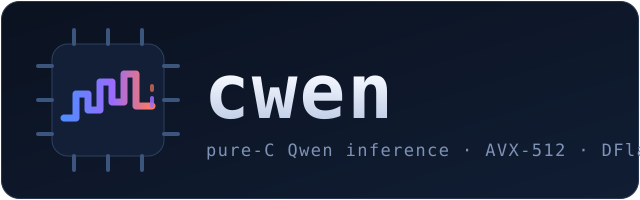

<div align="center">



**Pure-C inference for Qwen3.8-27B on the CPU you already own.**

mmap Q4 GGUF · AVX2/AVX-512 kernels · GatedDeltaNet hybrid · DFlash2 speculative decoding · single-file `run.c`

`make` · `./run model.gguf prompt.ids 96 -d 8` · lossless

</div>

---

## What it is

cwen is a from-scratch, dependency-free C engine that mmaps a Q4_0-quantized
Qwen3.8-27B GGUF and decodes on a desktop CPU (AMD Zen 3+ baseline, AVX-512
optional). One translation unit (`run.c`) holds the whole stack: GGUF/CWENR
loaders, quantized GEMV kernels, the qwen3.5 hybrid backbone (GatedDeltaNet +
periodic full attention), speculative decoding with two swappable drafters,
and a stdin/stdout frame server for harnesses.

Design goals: correctness gates before speed, bandwidth-honest kernels, no
heap repacking at load, and every knob failing loudly instead of silently.

## Features

- **Quantized CPU decode** - fused unpack+MAC GEMV for Q4_0/Q4_1/Q5_K/Q6_K/
  Q8_0/F32 plus offline CWENR sidecar layout (split scales, interleaved pairs)
  that halves weight traffic; OpenMP over output rows, one CCD by default.
- **Hybrid backbone** - GatedDeltaNet recurrent layers with periodic full
  attention (1:3), interleaved partial mRoPE, depthwise causal conv.
- **Speculative decoding, lossless** - block verify with batched GEMV
  (weights stream once per block), greedy prefix walk + bonus token,
  snapshot/rollback of recurrent state. Bit-identical to serial decode:
  - *n-gram drafter* - prompt-lookup over token history, zero weights;
    optional counted map persisted across runs (`CWEN_NGRAM_CACHE`).
  - **DFlash2 drafter** - trained 5-layer block-diffusion model conditioned
    on target hidden states, with grouped dynamic convs and a top-16
    candidate selector. Packs to ~2 GB Q8_0.
- **Long context** - runtime context window to 32k (`CWEN_CTX`) and opt-in
  YaRN rope scaling (`CWEN_ROPE_YARN`).
- **Verification culture** - gemv goldens vs numpy, e2e residual compares vs
  a numpy reference, a pinned decode-chain gate, loader fuzzing,
  microbenchmarks, and an interleaved A/B suite proving speculation never
  changes output.

## Quick start

```bash
git clone https://github.com/maci0/cwen && cd cwen
make setup          # .venv via uv (python tools)
tools/download.sh   # fetches the Q4_0 GGUF (~15 GiB) into model/

make                # AVX2 build; add AVX512=1 on Zen 4/5
.venv/bin/python tools/tok.py "Hello" -o prompt.ids --chat
./run model/Qwen3.8-27B-Q4_0.gguf prompt.ids 64
```

### CWENR weight sidecar

The GGUF stores per-block scales inline; the **CWENR sidecar** repacks Q4_0
offline into layouts the kernels like: pure-nibble streams with a separate
f16 scale channel (`RS`), and gate/up + k/v matrices interleaved so one pass
produces two outputs per weight stream (`RSI`).

```bash
make repack        # -> model/<name>.cwenr next to the GGUF (auto-mmap)
```

Same tokens, same API - detection is automatic, `CWEN_REPACK=FILE` overrides,
and a missing sidecar falls back to plain GGUF. Measured same-window A/B on
this box: decode ~x1.06 (2.06 vs 1.94 tok/s), ready-to-serve 0.7 s vs 3.6 s,
resident RAM ~12.7 GiB vs 15+ (GGUF pages dropped after rebind).

### Speculative decoding

```bash
# n-gram drafter, zero extra weights (great on repeats/code/tool calls)
CWEN_SPEC=1 ./run model.gguf prompt.ids 256 -d 8

# trained DFlash2 drafter (~2 GiB sidecar, one-time pack)
# fetch incoai/Qwen3.8-27B-DFlash2 with any HF client; the packer defaults
# to the HF-cache snapshot (pass a path if you keep it elsewhere)
.venv/bin/python tools/pack_dflash.py        # packs it -> model/dflash2.spec
CWEN_DFLASH=model/dflash2.spec ./run model.gguf prompt.ids 256 -d 8

# persistent n-gram map + long context
CWEN_SPEC=1 CWEN_NGRAM_CACHE=ngc.bin CWEN_CTX=16384 \
  CWEN_ROPE_YARN=8192,4 ./run model.gguf prompt.ids 512 -d 8
```

Drafted blocks are verified in one sweep; accepted prefixes are exact target
argmaxes, so output is bit-identical to serial decoding.

## Performance

Measured on Zen 5 (9950X, one CCD), AVX-512, shared-box conditions:

| Configuration | Result |
|---|---|
| Serial decode | ~2.8 tok/s |
| + n-gram drafter (pattern workloads) | 1.4-3.6x |
| + DFlash2 drafter (repeat-heavy) | **1.66x wall**, 5-6 tokens kept/cycle |
| Verify-block ceiling (B=8) | 3.91x vs serial forwards |

Acceptance is precision-sensitive: drafter weights want **Q8_0 or better**
(Q4_0 acceptance measured at zero).
<div align="center">

&nbsp;

</div>

Full numbers and methodology: [docs/DESIGN.md](docs/DESIGN.md),
"Speculative decoding landscape".

## Repository map

| Path | Role |
|---|---|
| `run.c` | the entire engine |
| `cwen_tune.h` | GA-tuned OpenMP/kernel constants |
| `Makefile` | build, goldens, benches, lint, fuzz entry points (`make help`) |
| `tools/` | download, tokenize, goldens, numpy references, packing, sweeps, fuzzing |
| `docs/DESIGN.md` | architecture, key decisions, PR history, technique comparison |
| `docs/OPTIMIZE.md` | per-kernel optimization lab notes |
| `docs/research/` | autoresearch loop journal |
| `docs/THREAT_MODEL.md` | loader threat model for fuzzing |
| `ref/` | llama.cpp sources kept locally for study (not part of the build) |

Weights, sidecars, goldens and outputs are generated at runtime and gitignored.

## Correctness & testing

```bash
make verify        # gemv goldens vs the model on disk
make verify-reproducible   # rebuild-and-compare: byte-identical binary across path/locale/TZ
make verify-e2e    # 4-layer residual compare vs numpy reference
make bench-spec    # speculation microbench: batched GEMV, rollback, block sweep
.venv/bin/python tools/spec_e2e.py --quick   # plain-vs-spec stream equality suite
make fuzz-run      # libFuzzer + ASan over GGUF/CWENR/.spec/frame parsers
make lint          # cppcheck + shellcheck + ruff + mypy
```

The durable gate (`tools/test_speed_gates.sh`) pins the decode chain so
weight or kernel changes cannot silently alter output.

## Docs

- [docs/DESIGN.md](docs/DESIGN.md) - why GGUF Q4_0, the hybrid backbone, key
  decisions K1-K18, speculative-decoding landscape with measured numbers
- [docs/OPTIMIZE.md](docs/OPTIMIZE.md) - kernel optimization loop history
- [CHANGELOG.md](CHANGELOG.md) - dated lab notebook
- [docs/THREAT_MODEL.md](docs/THREAT_MODEL.md) - what the loaders defend against

## Credits

- Qwen3.8-27B by [Qwen](https://huggingface.co/Qwen); GGUF quant ecosystem by
  [ggml](https://github.com/ggml-org)/llama.cpp contributors
- [DFlash2](https://inco.ai/blog/dflash2/) by Inco AI (drafter checkpoint
  `incoai/Qwen3.8-27B-DFlash2`, Apache-2.0)
- Reference study material: llama.cpp sources under `ref/` (MIT)

## License

[MIT](LICENSE). Model weights and drafter checkpoints keep their own licenses.
