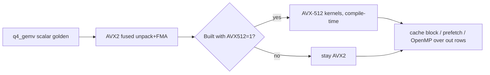
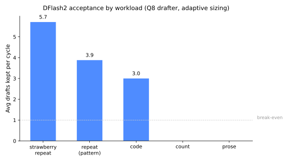
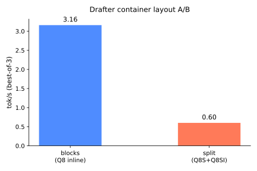
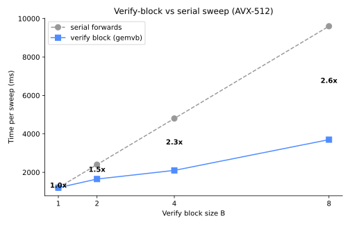
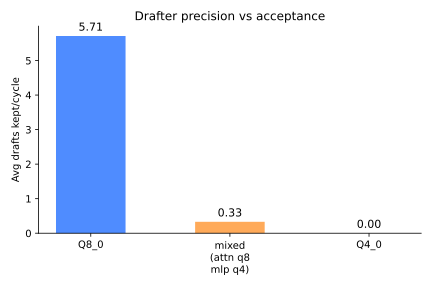

# cwen: Minimal Pure-C Qwen3.8-27B Q4_0 Inference (Zen 3+)

| Field | Value |
|-------|-------|
| **Document** | Design specification |
| **Date** | 2026-08-16 (rev 4.7 sync: 2026-08-24) |
| **Status** | Draft (rev 4.7: n-gram cache shipped sync) |
| **CPU target** | **Zen 3 and above** (AVX2 baseline; AVX-512 / AVX-VNNI optional on Zen 4/5) |
| **LOC** | Prefer lean single-file `run.c`; **no hard line cap** |
| **Weight format** | **GGUF Q4_0** (`unsloth/Qwen3.8-27B-GGUF` / `Qwen3.8-27B-Q4_0.gguf`, **16056478688 B / ~15.0 GiB**) |
| **On-disk types** | Mixed (verified on the 3.8 GGUF, 2026-08-16): mostly **Q4_0**, plus **Q4_1** (some `ffn_down`), **Q5_K** (all `ssm_out`), **Q6_K** (`output.weight`), **F32** (norms, GDN aux, conv), **Q8_0×1** (MTP `blk.64.nextn.eh_proj`) |

---

## Overview

**cwen** mmaps a **Q4_0** GGUF of Qwen3.8-27B and runs **text-only** decode on CPU in pure C. No network serve, no CUDA, no vision (opt-in modes: stdin frame loop `CWEN_SERVER=1`; block speculation `CWEN_SPEC=1` with the n-gram drafter, the model's own MTP nextn head (K19/PR18) or the trained DFlash2 drafter `CWEN_DFLASH`, K18/PR17; no sockets). HF `model_type` is still `qwen3_5`; hidden layout matches 3.5/3.6-27B.

Quant choice: **Q4_0** (block of 32 × int4 + one f16 scale). Half the DRAM traffic of 8-bit, trivial nibble unpack for **AVX2** (Zen 3+), clean path to **AVX-VNNI** (Zen 4/5). GPTQ-8 was deleted: worse bandwidth, worse packing, no CPU win.

Architecture stays the hybrid HF model: 64 layers, 3:1 GatedDeltaNet : full attention, dense SwiGLU MLP. Weights live in one GGUF file; tensors are located by name at load, then bound into global pointer tables.

---

## Goals & Non-Goals

### Goals
- mmap Q4_0 weights; generate tokens on CPU
- Modular functions, **global** hot state, later optional single-`main` inline
- Correct vs pure-numpy / llama.cpp goldens before SIMD
- Autonomous per-kernel optimization loop (`OPTIMIZE.md`)
- SIMD: **AVX2 required** (Zen 3+); AVX-512 behind `CWEN_AVX512` (compile-time flag; no runtime CPUID dispatch)

### Non-Goals
- Vision encoder, chat UI, network serve, training
- GPTQ / AWQ / MLX / NVFP4
- Q4_K superblocks (format tax; re-evaluate only if quality fails)
- Guaranteeing Zen 2 / pre-AVX2

---

## Key Decisions

| # | Decision | Rationale |
|---|----------|-----------|
| K1 | **Format = GGUF Q4_0** | Best Zen3+ tradeoff: ~16 GB, simple blocks, max bitwise/int surface, mmap-native |
| K2 | **SIMD baseline = AVX2** | Every Zen 3+ desktop core has AVX2+FMA; kernels must not require AVX-512 |
| K3 | **Optional AVX-512 / VNNI** | Zen 4/5 (e.g. 9950X): wider loads shipped via `-DCWEN_AVX512` (compile-time only, PR11); the int8 VNNI idea was benchmark-rejected (A/B flag `CWEN_IDEA_VNNI`, removed with the code) |
| K4 | **Single `run.c` + globals** | LOC + one-function-at-a-time opts; keep inference in one file |
| K5 | **Fused Q4 GEMV** (never full f32 dequant) | Bandwidth is the wall; unpack tile → int/float MAC → scale in one pass |
| K6 | **Compute fp32 for norms/GDN/attn softmax path** | Small tensors; keep correctness. Matmul is the int/Q4 game |
| K7 | **Text-only; ignore vision tensors if present** | Scope (MTP `blk.64` is bound as a drafter, K19) |
| K8 | **Decode-first GDN recurrent; prefill = serial recurrent** | Chunk GDN costs too many LOC |
| K9 | **Full-attn gate = sigmoid** (match transformers code, not config `swish` string) | HF source of truth |
| K10 | **Two RMSNorm flavors** | Layer/q/k/final: plain `w * rms` (Gemma `(1+w)` guess was wrong; green e2e vs numpy ref + llama.cpp pin this). GDN out norm: `w * rms * silu(z)` |
| K11 | **v0: pre-tokenized IDs; BPE optional** | Tokenizer is the first LOC cut |
| K12 | **E2e golden = streamed Q4 dequant + numpy** (or llama.cpp logits dump) | No full HF multimodal load |
| K13 | **Bandwidth-honest targets** | ~16 GB/token → ~5–6 tok/s theoretical @ 90 GB/s; usable **2–4 tok/s** early, higher after fuse |
| K14 | **Deleted GPTQ-8** | Wrong format for this CPU path |
| K15 | **Offline CWENR sidecar for Q4_0** (`tools/repack_q4.py`, `make repack`) | v4 layout (solo split + interleaved gate/up, k/v pairs); auto-mmap when `*.cwenr` sits next to the GGUF; no at-load heap repack. Kept after CHANGELOG I05 (tokens match, no metric loss) |
| K16 | **Opt-in stdin frame mode** (`CWEN_SERVER=1`) | Binary frames on stdin/stdout for bench harnesses; resets state per frame; no sockets, keeps the no-network non-goal |
| K17 | **Sidecar freshness stamp** | Header bytes 24..31 carry `{tag "CWEN", source GGUF size in 4KiB pages}`; `load_cwenr` drops a stamped sidecar whose source size no longer matches and falls back to the full-GGUF path, so replacing a GGUF without repacking cannot serve old weights (untagged legacy sidecars keep working) |
| K18 | **Opt-in n-gram block speculation** (`CWEN_SPEC=1` or `-d/--draft-tokens N`, greedy-lossless) | A drafter proposes a block after the pending token; one batched forward scores it, then a greedy walk keeps the longest verified prefix plus the target's own next pick. Greedy output is bit-identical to serial decode by construction; `tools/spec_check.py` pins this (identical token streams, both modes). Knobs: `CWEN_SPEC_NGRAM_N` / `_MAX_DRAFT` / `_MIN_DRAFT` / `_COOLDOWN`; optional `CWEN_NGRAM_CACHE=path` persists the counted n-gram map (NGC2) across runs; the CLI flag sizes the block like other engines' `--spec-draft-n-max`, wins over env, and implies `CWEN_SPEC=1`. Trained DFlash2 drafter plugs in behind the same proposal contract (shipped as `CWEN_DFLASH`, PR17) |
| K19 | **MTP nextn drafter** (`blk.64`, auto-detected; `CWEN_MTP=0` opts out) | The GGUF already ships a full decoder block plus `nextn.{eh_proj,enorm,hnorm,shared_head_norm}`. Stream slot *j* pairs token *t_j* with the target's final normed hidden *h_{j-1}* and predicts *t_{j+1}*; slot 0 has no predecessor hidden, so the stream starts at slot 1. Geometry is the target's full-attn layer (NH=24, NKV=4, HD=256, per-head interleaved q/gate, sigmoid output gate, sectioned RoPE), so it reuses `rope_apply` and `attention_heads_kv` rather than carrying its own copies. Chained drafts recurse on the nextn layer's own output, the single-block head having no deeper hidden to feed itself. Ranks below `CWEN_DFLASH` and above the n-gram map |
| K20 | **Unpack-once batched GEMV** (`dot_q4_bcol`, AVX-512, `2 ≤ B ≤ 8`) | `gemvb` called a per-column dot B times per row, so the nibble split, int8→f32 widen and scale multiply ran B times while only the weight *load* was shared; `T_Q4_0RSI` had no batched path at all and fell through to the generic `gemv_row` loop. The kernel dequantizes each 32-weight block once into two `__m512` and FMAs against every column, one accumulator per column so `B ≤ 8` fits the register file. Wider blocks and non-AVX-512 builds keep the per-column path; `-DCWEN_NO_BCOL` compiles it out for A/B. Measured min-of-R on `bench_spec`: `attn_qkv` 1.61x and `ffn_gate` 2.07x at B=8, with the B=1 control flat. Correctness is gated by `bench_spec`, which checks every GEMVB B against B independent `gemv` calls |

---

## Why Q4_0 on Zen 3+

```text
Per block (QK4_0 = 32 weights):
  scale: f16          // 2 bytes
  qs:    u8[16]       // 32 nibbles, low then high in each byte (GGUF order)

  w[i] = scale * (nibble(i) - 8)     // nibble in 0..15, centered
```

| Property | Q4_0 | Q8_0 | GPTQ-8 (deleted) |
|----------|------|------|------------------|
| Size (27B) | ~15.8 GB | ~28.6 GB | ~31 GB |
| Bytes/weight | 0.5 + scale/32 | 1 + scale/32 | ~1 + meta |
| Unpack | nibble + bias | none | int32 pack + groups + zp |
| AVX2 fit | excellent | excellent | poor |
| VNNI path | unpack→i8 then VNNI | native i8 | awkward |
| Hand-rolled LOC | low | lowest | high |

**Zen 3:** AVX2 unpack (`_mm256_and_si256`, shifts, `cvtepi8_epi32` / float convert) + FMA.  
**Zen 4/5:** same + 512-bit loads. The int8 VNNI variant was benchmark-rejected (see K3); AVX-512 fp32 is the shipped wide path.

Q4_K_M is slightly better quality at similar size but superblock layouts burn LOC. Stay on Q4_0 unless goldens show quality pain.

---

## Model geometry (text)

From official `Qwen/Qwen3.8-27B` `config.json` `text_config` (same numbers as 3.6-27B):

| Param | Value |
|-------|-------|
| layers | 64 |
| pattern | `layer_types[i]`: full attn when `i % 4 == 3`, else GatedDeltaNet |
| hidden | 5120 |
| intermediate | 17408 |
| vocab | 248320 |
| full attn heads / KV / dim | 24 / 4 / 256 |
| partial RoPE | 0.25 → 64 rotary dims; mRoPE sections `[11,11,10]`, interleaved |
| GDN k/v heads | 16 / 48 |
| GDN head dim | 128 / 128 |
| conv kernel | 4 |

### GGUF facts (verified on disk, 2026-08-16)

```text
model/Qwen3.8-27B-Q4_0.gguf   # 16056478688 B (~15.0 GiB), GGUF v3, arch qwen35
  block_count = 65  (64 text layers + MTP blk.64), embedding_length = 5120
  tensors = 866
  type histogram: F32×456, Q4_0×352, Q4_1×8, Q5_K×48, Q6_K×1, Q8_0×1
  Q8_0 = blk.64.nextn.eh_proj.weight (MTP eh_proj; bound, K19)
  engine binds layers 0..63 as the trunk, blk.64 as the nextn drafter
```

**Naming (llama.cpp / qwen35):**

| Role | Name pattern | Type |
|------|--------------|------|
| embed | `token_embd.weight` | Q4_0 `[5120, vocab]` |
| lm_head | `output.weight` | **Q6_K** `[5120, vocab]` |
| final norm | `output_norm.weight` | F32 |
| GDN (linear layers) | `blk.N.attn_qkv`, `attn_gate`, `ssm_*`, `ffn_*` | Q4_0 / Q4_1 / Q5_K / F32 |
| full attn (`N%4==3`) | `attn_q/k/v/output`, `attn_q_norm`, `attn_k_norm` | Q4_0 + F32 |

Example GDN layer 0: `attn_qkv` Q4_0 `[5120,10240]`, `ssm_out` **Q5_K** `[6144,5120]`, `ssm_conv1d` F32 `[4,10240]`, `ssm_a`/`ssm_dt` F32, `ffn_down` often **Q4_1**.

**Implication for C:** not a pure-Q4_0 file. Minimum type support:

1. **Q4_0** fused GEMV (hot path, most weights)  
2. **Q4_1** GEMV (min+scale blocks; few tensors)  
3. **Q5_K** GEMV (`ssm_out` × 48 layers; required)  
4. **Q6_K** GEMV (`output` lm_head only)  
5. **F32** copy / tiny GEMV (norms, conv, α/β, A_log)

Escape hatch if LOC ever blows: requantize every tensor to one C-friendly type offline, then drop K-quants from C. Not needed so far (mixed GGUF fully supported; one file, no extra 16 GB). Note the shipped `tools/repack_q4.py` does not do this: it rewrites Q4_0 payload layout only (K15) and leaves Q4_1/Q5_K/Q6_K in the GGUF.

---

## Repository layout

```text
cwen/
  docs/
    DESIGN.md
    OPTIMIZE.md
    THREAT_MODEL.md       # loader threat model for fuzzing
    research/             # autoresearch loop records (autoresearch.md/.jsonl; driver tools/autoresearch.sh)
  CHANGELOG.md           # lab notebook: PR/I log, per-iteration results
  README.md
  Makefile
  run.c                 # the entire engine
  cwen_tune.h           # GA-tuned constants, generated by tools/ga_evolve.py (make ga)
  tools/                # Python/shell; not in C LOC (non-exhaustive)
    download.sh
    hf_fetch.py         # one-file HF download, called by download.sh
    dump_gguf.py
    ref_kernels.py      # Q4 dequant + GDN/attn/MLP numpy
    gen_golden.py
    e2e_ref.py          # numpy e2e reference (residuals + logits)
    repack_q4.py        # offline GGUF Q4_0 → CWENR v3/v4 sidecar (make repack)
    ga_evolve.py        # GA/symbolic tune → cwen_tune.h (make ga)
    ga_expr_check.py    # GA eval_expr vs emitted C, log parser (make ga-check)
    measure_when_quiet.sh  # loadavg gate; every absolute tok/s number needs it
    median_bench.py     # kernel microbench protocol
    tok.py
    opt_loop.sh
    accept.py
    vendor/             # third-party copies: pin, license, drift check
      README.md         # upstream revision and local-patch manifest
      check.sh          # diff the tree against the pinned revision
      cddl1.txt         # FlameGraph license (flamegraph.pl, stackcollapse-perf.pl)
  model/
    Qwen3.8-27B-Q4_0.gguf
    Qwen3.8-27B-Q4_0.cwenr   # optional sidecar (K15), auto-mmap when present
    dflash2.spec         # optional DFlash2 drafter container (K18/PR17, tools/pack_dflash.py)
    config.json         # architecture reference
    tokenizer.json ...
  golden/
```

---

## Proposed design

### Load path

1. `open` + `mmap` entire GGUF (or `MAP_PRIVATE`).
2. Parse GGUF header: magic, version, KV metadata, tensor info array (name, dims, type, offset).
3. Build `TensorIndex` (name → `{ptr, ne[], type}`). Parse any type; tensors the engine binds are always in `{Q4_0, Q4_1, Q5_K, Q6_K, F32}` (+`Q8_0` kernel available), unknown quants on unbound tensors are ignored, never dequantized.
4. `rebind_layers_from_tens()` / `resolve`: fill `LayerW[64]` with pointers + type tags for that layer’s tensors once; missing required names abort.
5. Dispatch GEMV by `tensor->type` inside `gemv_row` (`dot_q4_0` / `dot_q4_1` / `dot_q5_K` / `dot_q6_K` / `dot_q8_0` / `dot_f32`, plus CWENR `T_Q4_0R/RS/RSI`).

GGUF data section is 32-byte aligned per tensor; do not hand-roll offsets without the header.

### Q4_0 block (GGUF / ggml)

```c
// ggml Q4_0, little-endian
#define QK4_0 32
typedef struct { uint16_t d; uint8_t qs[QK4_0/2]; } block_q4_0; // d = f16 scale

// nibble i: (i&1)? qs[i/2]>>4 : qs[i/2]&0xF
// value: (nibble - 8) * f16_to_f32(d)
```

Matrix layout for linears: **row-major over output**, each row is a sequence of `block_q4_0` covering `K` (in) features. Confirm with one golden `gemv` against numpy dequant of the same bytes (PR3 gate).

### Hot kernels (modular, globals)

| Function (current symbol) | Role |
|----------|------|
| `gemv` / `dot_q4_0` (+`dot_q4_1/_q5_K/_q6_K/_q8_0/_f32`) | `y[out] = W[out,in] * x[in]` fused unpack+MAC+scale; CWENR rows via `T_Q4_0R/RS/RSI` |
| `f16_gemv` / `bf16_gemv` | not needed: dump shows no F16/BF16 tensors on disk |
| `rmsnorm` | one flavor for layer/q/k/final; GDN gated norm (`w*rms*silu(z)`) inline in `gdn_step` |
| `silu_vec` / `softplus` / `sigmoid` | elementwise |
| `rope_apply` | interleaved text mRoPE on rotary dims (`ROPE_SEC={11,11,10}`) |
| `gdn_step` | one-token Gated DeltaNet recurrent update |
| `conv1d_update` | depthwise causal conv k=4 + SiLU |
| `layer_full` | GQA + RoPE + sigmoid gate + KV append |
| `mlp` | gate/up/down SwiGLU (one OMP team) |
| `embed_token_to` / `argmax_logits` | embed lookup; lm_head over last position, argmax sample (v0) |

### Globals (sketch)

```c
// dims
enum { H=5120, I=17408, V=248320, L=64, MAX_SEQ=32768,
       NH=24, NKV=4, HD=256, LKH=16, LVH=48, LKD=128, LVD=128 };

float x[H], xb[H], xb2[H], hb[I], hb2[I];
float qg[/* q_proj double width */ 2*NH*HD]; // discover exact
float k[NKV*HD], v[NKV*HD];
float att[NH*MAX_SEQ];
float logits[V]; // or stream lm_head without full buffer if LOC/memory tight

// GDN
float s[L][LVH][LKD][LVD];      // or only for linear layers
float conv[L][/* mixed dim */][4];
float lq[LVH*LKD], lk[LVH*LKD], lv[LVH*LVD], lo[LVH*LVD], lz[LVH*LVD];

// full attn KV
float kc[L][MAX_SEQ][NKV*HD], vc[L][MAX_SEQ][NKV*HD]; // sparse: only full layers

// weights
typedef struct { /* q4 ptrs + shapes for one layer */ } LayerW;
LayerW W[L];
void *map_base; size_t map_len;
```

Size note: GDN state ~48 layers × 48 × 128 × 128 × 4 ≈ 144 MiB. KV allocates all 64 layer slots sized by the runtime context cap (`CWEN_CTX`, default 4096; compile-time `MAX_SEQ=32768` is the hard ceiling): ≈ 2 GiB at the default; the 16 full layers use ~512 MiB of it. Fits in 123 GiB with mmap.

### Forward (decode token)

```text
x = embed[token]
for layer in 0..63:
  n = rmsnorm(x)
  if linear:
    gdn_layer(n) → residual add
  else:
    full_attn_layer(n) → residual add
  n = rmsnorm(x)
  mlp_swiglu(n) → residual add
x = rmsnorm(x)
logits = lm_head(x)   // only current token
token = argmax(logits)
```

### GDN recurrent (match HF)

```text
g = exp(-exp(A_log) * softplus(a + dt_bias))   // decay in (0,1]
β = sigmoid(b)
q,k = l2norm(q), l2norm(k); repeat k heads to v heads
S = g * S
delta = β * (v - S^T k)
S = S + k ⊗ delta
o = S^T q   // then gated RMSNorm * silu(z), out_proj
```

Plus causal depthwise conv on qkv before the rule.

### Full attention

GQA, partial interleaved mRoPE, softmax, **output × sigmoid(gate)**, o_proj. KV cache append.

---

## SIMD strategy (Zen 3+)



### AVX2 Q4 GEMV sketch (product path)

```c
// For each output row r:
//   acc = 0
//   for block b over K/32:
//     load scale; load 16B qs
//     for j in 0..31:
//       nibble -> (n-8)*scale
//       acc += w * x[b*32+j]
//   y[r] = acc
// Optimize: process 8 floats of x with _mm256, unpack 8 weights, fmadd
```

### Int8 VNNI path (benchmark-rejected)

The idea (dynamic-quant `x` tile to u8 + scale_x, expand q4→i8, `VPDPBUSD` accumulate,
`y = acc * scale_w * scale_x`) was A/B'd via `CWEN_IDEA_VNNI=1`: it failed the Q4
golden and ran ~0.5× slower (`OPTIMIZE.md` idea table). Rejected and removed; no VNNI
code remains in `run.c`. Wide-load gains ship via the compile-time AVX-512 kernels (K3).

### OpenMP

Parallelize over **output rows** of `q4_gemv` (`#pragma omp parallel for`). Do not race residual buffers.

---

## LOC guidance (`run.c` only; no hard max)

| Block | Target LOC (soft) |
|-------|------------|
| GGUF mmap + index + resolve | 160 |
| Q4_0 + Q4_1 GEMV | 160 |
| Q5_K + Q6_K GEMV (port ggml tables) | 200 |
| F32 helpers | 40 |
| rmsnorm / silu / softplus / sigmoid / rope | 120 |
| gdn_step + conv | 180 |
| full_attn + KV | 180 |
| mlp + layer loop + embed/lm_head | 120 |
| sample + main | 80 |
| **Total working** | **~1140** |
| Hard max | **none** |

If the file grows awkward: BPE, fancy sampling, chunk GDN, debug dumps first; then **repack script** to drop Q5_K/Q6_K from C if needed.

---

## Correctness / golden path

1. `tools/dump_gguf.py`: list tensors, types, nbytes  
2. `ref_kernels.py`: stream Q4 dequant **one row or one matrix at a time**; reference gemvs `gemv_stream` (row-at-a-time) and `gemv_np` (numpy fast path, batched Q5_K/Q6_K)  
3. Goldens: single `q4_gemv`, one GDN step, one full layer, then e2e logits for N≤32 tokens  
4. **Never** materialize full f32 27B (~100+ GB)  
5. PR merge of full forward requires green e2e (single gate)

---

## Autonomous optimization process

See `OPTIMIZE.md`. Summary:

```text
pick kernel → freeze contract (shapes, globals) → gen golden →
bench scalar → implement candidate (AVX2/AVX-512/block) →
accept if faster AND max_abs/rel err ≤ tol → record baseline → next
```

Harness is Python/shell outside C LOC. Microbenches live in `run.c` behind `-DCWEN_BENCH_Q4_GEMV` and `-DCWEN_BENCH_SPEC` (same code as production).

---

## Alternatives considered

| Option | Why not (for this project) |
|--------|----------------------------|
| GPTQ-8 safetensors | Deleted: GPU packing, 2× bandwidth, hard C |
| Q8_0 GGUF | Clean VNNI but ~2× RAM traffic → fewer tok/s |
| Q4_K_M | Better quality; superblocks blow LOC for hand C |
| Q5_K_M | Larger; keep as fallback download if Q4_0 quality fails |
| llama.cpp only | Valid product path, but user wants custom C optimize loop |
| MLX / NVFP4 | Wrong ISA |

---

## Risks

| Risk | Sev | Mitigation |
|------|-----|------------|
| GGUF tensor names differ from HF | med | dump at load; bind by discovered names |
| Q4_0 nibble order / row major wrong | high | PR3 single-linear golden before layers |
| GDN/HF mismatch | high | numpy port of HF recurrent step |
| Zen 3 only has AVX2 | n/a | baseline kernels AVX2; no 512 required |
| LOC overrun (GGUF parser) | med | minimal parser; no general GGML |
| Quality of Q4_0 | low | optional later Q5_0 swap same code path |

---

## Security & operability

- Local CLI; no network after download  
- Bounds-check tensor offsets vs mmap length  
- Untrusted-input fuzzing: `make fuzz` builds `run.c` + `tools/fuzz_loader.c` with libFuzzer/ASan/UBSan (`-DCWEN_FUZZ_LOADER`) over GGUF/CWENR/DFlash-`.spec` parsing, the request-frame parser, and the NGC2 n-gram-cache round trip; `make fuzz-seeds` regenerates `tools/fuzz_corpus`, `make fuzz-run` does a short guided run (artifacts under `fuzz_out/`; needs clang)  
- `CWEN_DUMP=dir` + `CWEN_DUMP_LAYERS=n` (+`CWEN_DUMP_LOGITS`) for debugging/e2e dumps  
- `CWEN_SERVER=1`: persistent binary frame loop on stdin/stdout (K16); EOF exits  
- `CWEN_SPEC=1`: n-gram block speculation, greedy-lossless vs serial decode (K18); verified by `tools/spec_check.py`  
- Page-in happens at load, not first token (`MAP_POPULATE`/`MADV_POPULATE_READ`); with a CWENR sidecar the GGUF warm is deferred and Q4 pages are dropped after rebind

---

## MTP nextn stream (K19)

Who writes which nextn slot, and what a rejected tail undoes. Source:
`docs/assets/mtp-stream.mmd`.



The invariant that makes the two paths safe to interleave: slot *j*'s K/V
depend on `(t_j, h_{j-1})` and not on slot *j-1*'s output, so a commit is a
pure function of already-verified state, while only the chained *draft*
carries the nextn layer's own hidden forward.

---

## Speculative decoding landscape (2026-08-23)

Comparison behind the PR16/PR17 work, recorded with measurements so future
drafter work starts from data instead of blog claims. Published acceptance
lengths are per-request means for Qwen3.8-27B at block size 8 (inco.ai DFlash2
post, Table 4); cwen columns are this box, greedy, shared-load conditions.

| | baseline (serial) | MTP | DFlash | DFlash2 |
|---|---|---|---|---|
| Mechanism | one weight sweep per token | model's nextn head drafts autoregressively | 5-layer block-diffusion drafter fed target hidden states | DFlash + grouped dynamic convs + top-16 candidate selector |
| Extra weights | none | ~1 nextn layer (already in the GGUF: `blk.64.nextn.*`) | ~1.9B | ~1.9B + ~65M conv/selector |
| Draft cost per cycle | 0 | ~1 small forward **per drafted token** | 1 window forward (~13 GMACs at B=8) | same + selector |
| Acceptance length (published) | 1.0 | 4.28 mean | superseded; Muse Glimmer upgrade path 4.44 to 5.70 | **4.80** mean |
| Throughput vs serial (their GPU stack) | 1x | ~2x | ~2.5-3x | **2.7-3.4x** |
| In cwen | default path | shipped (PR18, auto-detected from `blk.64`) | skipped (checkpoint declares DFlash2) | shipped (`CWEN_DFLASH`) |

cwen measurements (greedy, byte-identical output verified in every case):

| Config | Acceptance kept/cycle | Same-window wall | Source |
|---|---|---|---|
| Serial decode | - | ~2.8 tok/s documented quiet-box AVX512 | CHANGELOG historical pin |
| ngram-simple drafter | fires only on history repeats | 1.4-3.6x pattern workloads, ~parity elsewhere | `tools/spec_e2e.py` interleaved suite |
| DFlash2 Q8_0 | avg kept 5.2-6.0, up to 7/9 full accepts | **1.66x** repeat-heavy; ~0.8x drifting (rejection snapshot+replay cost) | sweep 2026-08-23 |
| MTP nextn (`blk.64`) | count 8.00, repeat 7.33, code 5.00, strawberry 4.20, prose 1.43 (`-d 8`); 11.00 at `-d 15` | 1.08-1.37x on four of five cases, 0.90x on prose (loadavg ~42, prefill-dominated frames) | `tools/spec_e2e.py` 2026-08-26 |
| Verify ceiling, any drafter | - | B=2: 1.46x, B=4: 2.69x, B=8: 3.91x per sweep | `bench_spec` BLOCK |

Profiling (perf, AVX-512, 128 tok strawberry DFlash2):

| Kernel | Self % | Role |
|---|---|---|
| `dot_q4_0rs_2row` | 26.1% | target backbone GEMV |
| `dot_q4_0rsi` | 22.0% | interleaved gate/up dual-mat |
| `dot_q6_K` | 17.2% | lm_head over full vocab |
| `dot_q4_0rsi_2mat` | 14.3% | drafter paired gate/up |
| `dot_q5_K` | 8.8% | ssm_out projection |

88% self-time in four dot kernels streaming weights at memory bandwidth,
the architecture is working as intended. Flamegraph at
`docs/assets/flamegraph-dflash2.svg`. Adaptive draft sizing (rolling
acceptance window) prevents waste on low-match workloads.

### Measured comparison charts









### Comparison charts


Facts worth remembering:

- Drafter quantization is categorical, not gradual: Q4_0 drafter weights gave
  literally zero accepted proposals on this model; Q8_0 restored 5-6 kept per
  cycle. Do not ship a Q4 draft.
- The gap to the published 2.7-3.4x is CPU reality: the drafter costs real
  compute per cycle here, and rejected blocks pay snapshot+replay.
- Headroom: unpack-once batched GEMV kernels would raise the BLOCK ceiling;
  adaptive draft sizing would soften the drifting-workload regression.
- Open option, now shipped (2026-08-24): counted n-gram map + persistent cache
  (llama.cpp `ngram-cache` style), `CWEN_NGRAM_CACHE=path`, NGC2 format. Drafts
  by chained lookup over learned continuations with least-hit eviction at the
  2^18-entry cap; the history scan stays as fallback. Listed here as unbuilt
  through rev 4.6; see `CHANGELOG.md` 2026-08-24 for the correctness pass.

## Rollout (PR plan)

Original plan (2026-08); actual progress is tracked in `CHANGELOG.md`, `OPTIMIZE.md`,
and `autoresearch.md`. Shipped so far: PR1–PR10 (incl. fused Q4 gemv + OpenMP),
the optional AVX-512 kernels of PR11 (the int8 VNNI idea was benchmark-rejected;
its A/B flag `CWEN_IDEA_VNNI` was removed with the code), the opt-in n-gram
block-speculative decoder of PR16
(`CWEN_SPEC=1`, K18; greedy-lossless per `tools/spec_check.py`), the trained
DFlash2 drafter of PR17 (`CWEN_DFLASH`), and PR19 (counted n-gram map +
persistent cache `CWEN_NGRAM_CACHE`, runtime `CWEN_CTX` to 32768, opt-in YaRN
`CWEN_ROPE_YARN`).
Sampling beyond argmax and BPE remain unbuilt.

### PR1: Skeleton + Q4_0 present
- Files: Makefile, DESIGN, OPTIMIZE, `tools/download.sh`, `.gitignore`  
- Verify `model/Qwen3.8-27B-Q4_0.gguf` size 16056478688 B (~15.0 GiB)  

### PR2: GGUF mmap + tensor index + resolve_weights  
- Dump names; bind LayerW  

### PR3: `q4_gemv` scalar + golden vs numpy  
- **Gate:** one real linear matches  

### PR4: RMSNorms, SiLU, softplus, mRoPE  
### PR5: MLP SwiGLU  
### PR6: GDN step + conv state  
### PR7: Full GDN layer  
### PR8: Full attention + KV  
### PR9: E2e forward + generate + **green golden-e2e** (one merge unit)  
### PR10: AVX2 fused `q4_gemv` + OpenMP  
### PR11: Optional AVX-512 path (`-DCWEN_AVX512`, compile-time)  
### PR12: Optimize gdn_step / lm_head  
### PR13: Optional sampling  
### PR14: Optional BPE  
### PR15: Inline-main experiment + harness polish  
### PR16: N-gram block speculation (`CWEN_SPEC=1`, K18), shipped
- DFlash-style block verify in `run.c`; one batched forward per block, longest verified prefix kept, greedy output bit-identical to serial decode (`tools/spec_check.py`)
### PR17: Trained DFlash2 drafter behind the `ngram_draft` proposal contract (`CWEN_DFLASH=model/dflash2.spec`), shipped
### PR18, MTP nextn drafter (`blk.64`, K19), shipped
- Correct nextn forward (per-head q/gate split, sectioned RoPE, gated GQA over its own K/V, shared-head norm into the shared lm_head), one commit step per verified position, autoregressive chaining for E>1. Acceptance went 0 to 2.9-4.0 kept/cycle; output byte-identical to serial decode.
- Short-walk rollback now re-scores the kept prefix in one block sweep instead of k+1 serial forwards, and adaptive sizing became AIMD on full accepts (acceptance *rate* rewarded exactly the draft lengths that short-walk every cycle).
### PR20, Unpack-once batched GEMV (`dot_q4_bcol`, K20), shipped
- Q4_0RS and Q4_0RSI rows dequantize once per 32-weight block and FMA against every column of the verify block; `attn_qkv` 1.61x and `ffn_gate` 2.07x at B=8.
### PR19: n-gram counted map + persistent cache (`CWEN_NGRAM_CACHE`); runtime `CWEN_CTX` to 32768; opt-in YaRN (`CWEN_ROPE_YARN`), shipped

---

## Measurement traps

Absolute tok/s needs loadavg under 12. Under load 21 the verify-block ceiling
measures 1.46x at B=8 against the documented quiet-box 3.91x, so a shared-box
number is a lower bound, not a result. `tools/measure_when_quiet.sh -l LOAD -w
SECONDS -- cmd` blocks until the window opens and exits 75 if it never does.

`perf stat` on the decode path loses most of the OpenMP threads:
`perf stat -e instructions:u ./run ... -d 8` reports ~21.7G instructions and 5s
of task-clock for a run that burns ~400 CPU-seconds, and the counts stay stable
across configurations that do genuinely different work, which makes them look
trustworthy. A/B kernels with wall-clock min-of-R on `bench_spec` or with
`tools/spec_e2e.py`, never with those counters.

The AVX-512 build needs its own gate. Two Q8S/Q8SI kernels sat uncompilable for
a release because CI only built AVX2, and `mtp_step`'s activation buffers were
missing `__attribute__((aligned(64)))` in a way only `-flto` exposed: without
LTO the `_mm512_load_ps` never materialized and every test passed. CI now
compiles `AVX512=1`.

## Open questions

1. ~~Exact GGUF tensor dtypes for embed/lm_head~~ **Answered by the 2026-08-16 dump:** `token_embd` Q4_0, `output.weight` Q6_K (present; the tied-embeddings fallback in `load_gguf` is defensive only).  
2. If Q4_0 quality is unacceptable on a small eval, swap file to Q5_0 with same kernels. *(still open)* 
3. Extend `dot_q4_bcol` to `T_Q4_1` (`ffn_down`) and `T_Q6_K` (`output.weight`): both still redo the unpack per column, and the lm_head is paid once per drafted token.
4. Cheapen the MTP draft head. 27.8 ms of the 36.5 ms per proposal is the shared lm_head; DFlash2 sidesteps it with a top-16 selector walk.
5. Batch MTP commits. Nextn slot K/V depend only on `(t_j, h_{j-1})`, not on the previous slot's output, so a prefill chunk or an accepted block could go through one `gemvb` sweep instead of one `gemv` per position. Worth roughly 5%.

---

## References

- [Qwen/Qwen3.8-27B](https://huggingface.co/Qwen/Qwen3.8-27B)  
- [unsloth/Qwen3.8-27B-GGUF](https://huggingface.co/unsloth/Qwen3.8-27B-GGUF)  
- [GGUF spec](https://github.com/ggerganov/ggml/blob/master/docs/gguf.md)  
- ggml `block_q4_0` / llama.cpp q4_0 kernels (reference, not a dependency)  
- HF Qwen3.5 / Qwen3-Next GatedDeltaNet + config in `model/config.json`  
- Prior cwen GPTQ design (rev 3): superseded by this document  

---

## Changelog

| Rev | Change |
|-----|--------|
| 4.7 | Currency sync: counted n-gram map + persistent cache shipped (`CWEN_NGRAM_CACHE`, NGC2, least-hit eviction at the 2^18 cap; was "open option, not built"); K18 records the knob; globals sketch corrected to `MAX_SEQ=32768` with the runtime `CWEN_CTX` cap (default 4096) sizing the KV caches; layout adds generated `cwen_tune.h` |
| 4.6 | Security & operability records the shipped untrusted-input fuzz harness (`make fuzz`/`fuzz-seeds`/`fuzz-run`, `tools/fuzz_loader.c`, `-DCWEN_FUZZ_LOADER`); no decision changes |
| 4.6 | Speculation landscape section added: baseline/MTP/DFlash/DFlash2 comparison (published acceptance + cwen same-window walls), Q4-drafter zero-acceptance trap, verify ceiling numbers, PR18 MTP candidate noted (tensors already on disk); PR17 marked shipped |
| 4.5 | Spec harnesses recorded: `bench_spec` microbench (GEMVB scaling+correctness, SNAP rollback cost, BLOCK min-of-R sweep) and `tools/spec_e2e.py` multi-prompt gate over K16 frames (resident engines, rotating frames, byte-identical-stream gate); CLI `-d/--draft-tokens N` added under K18; driver takes serial steps when no drafts proposed; parallel snapshot copies |
| 4.4 | Currency sync vs `run.c`: K18 records the shipped n-gram block-speculative decoder (`CWEN_SPEC=1`, PR16; `tools/spec_check.py` pin) and PR16/PR17 added to the rollout (fixes the `run.c` → "DESIGN.md PR17" cross-reference); VNNI section marked benchmark-rejected per OPTIMIZE idea table; AVX-512 selection corrected to compile-time in flowchart + PR11 heading (no runtime CPUID dispatch exists); K16/K17 rows ordered; layout lists README/CHANGELOG/autoresearch |
| 4.3 | Currency sync vs `run.c` + on-disk dump: K10 norm flavor corrected (plain `w*rms`), K15 CWENR sidecar and K16 stdin frame mode recorded, 3.8 GGUF facts filled in (866 tensors incl. MTP `blk.64` + Q8_0), load-path accept-set matches parser, kernel names aligned to code |
| 4.2 | Retarget default GGUF/tokenizer to **Qwen3.8-27B**; text dims unchanged (`qwen3_5`) |
| 4.1 | On-disk dump: mixed Q4_0/Q4_1/Q5_K/Q6_K/F32; tensor names `qwen35` / `blk.N.*` |
| 4 | **Switch format to GGUF Q4_0; delete GPTQ; Zen 3+ AVX2 baseline** |
| 3 | GPTQ packing fixes, e2e stream oracle (historical) |
